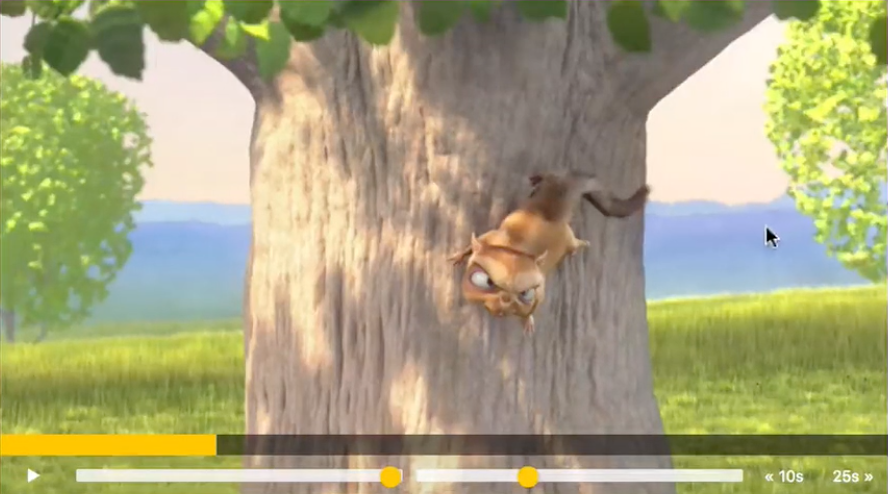

# Custom HTML5 Video Player Exercise

## Description
This is a learning exercise using Wes Bos' 11th-day coding challenge called Custom HTML5 Video Player. This exercise is part of a larger 30-day coding challenge called [JavaScript30](https://javascript30.com/).

Implemented features shown in the video (except one: progress bar click and move) and also added some of my own. HTML and most of the CSS was already written. I wrote all of the JS and edited some of the CSS using JS. The goal was to build my own version of the video player from scratch.

I don't use classes and I use the comment below to separate  groups of code in JS file:
``` 
// ------------------------------------------
```
This was done purely for learning purposes to understand what variables belong together with which functions. 

## Video player
Image of an original video player:



Finished project:


## Features
Built all of the original features and then added some.

### Original video features:
- Press play, the video starts playing and an icon of the button changes from play to pause. Same 
works for pause. 
- Volume scrubber to change the volume. 
- Playback rate scrubber to change the speed of the video playback.
- Clickable progress bar to skip the video and to match the length of the video. Shows the user 
how far they are into watching the video. 
- Responsive video player.

### My added features:
- Press down on the space bar to play/pause the video.
- Added fullscreen feature.
- Material Design icons.
- Added volume and playback rate icons.
- Replaced 10 sec backward and 30 sec forward icons.
- Changed the original skip video 25sec forward feature to 30sec.
